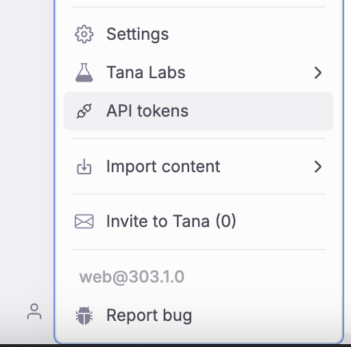
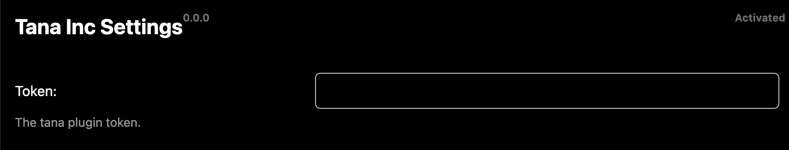

# Moon [Tana Inc](https://tana.inc/) Plugin

<span class="badge-npmversion"><a href="https://npmjs.org/package/@moonjot/moon-tana-inc-plugin" title="View this project on NPM"></a></span>
<span class="badge-npmdownloads"><a href="https://npmjs.org/package/@moonjot/moon-tana-inc-plugin" title="View this project on NPM"></a></span>


Send Note from your OS to Tana.inc with your current context. Make it faster to take note into Tana.inc

Get tana token






## Features

Handle dates like YYYY-MM-DD
Handle drop image
Handle code blocks

## Development

```bash
yarn
```

## Build before publishing

```bash
yarn build
```

## For dev mode run 

```bash
yarn watch
```

## Publishing

First remove current git origin
```bash
git remote remove origin
```

Add you repo origin and change also **credential** iin `package.json`

Then
```bash
yarn pub
```