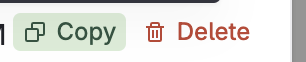

# Moon [Tana Inc](https://tana.inc/) Plugin

<span class="badge-npmversion"><a href="https://npmjs.org/package/@moonjot/moon-tana-inc-plugin" title="View this project on NPM"></a></span>
<span class="badge-npmdownloads"><a href="https://npmjs.org/package/@moonjot/moon-tana-inc-plugin" title="View this project on NPM"></a></span>


Send Note from your OS to Tana.inc with your current context. Make it faster to take note into Tana.inc

Get tana token

Go to settings


Create a token


Copy the token


Past it inside Moon Jot Settings


## Features

Support [[date:]] https://tana.inc/docs/tana-paste (Contact me for other Tana past support 🙏)

Handle dates like YYYY-MM-DD

Handle drop image

Handle code blocks

## Features

Handle dates like YYYY-MM-DD

Handle drop image

Handle code blocks

## Template

```
{{content}}
{{IF source.url}}Source: <a href="{{source.url}}">{{source.title}}</a>{{END_IF source.url}}
{{IF people.0.name}}Author: {{people.0.name}}{{END_IF people.0.name}}
```


## Condition

### Is defined

You can insert content based on a condition.
Currently, the condition only checks if something exists or does not exist.
```
{{IF ...}}Write something{{END_IF ...}}

// Example:
{{IF author}}Author: {{author}}{{END_IF author}}
```

### You can also do some condition with equality

#### === undefined
```
{{IF author === undefined}}content{{END_IF author}}
```

#### === some text
```
{{IF content === some text}}content{{END_IF content}}
```

#### !== some text
```
{{IF content !== some text}}content{{END_IF content}}{{IF content !== some text hey }}content different{{END_IF content}}
```

#### .includes(something)
```
{{IF content.includes(some t)}}content{{END_IF content}}{{IF content.includes(some text hey) }}content different{{END_IF content}}
```

#### .startsWith(something)
```
{{IF SOURCE.TEXT.startsWith(- [ ])}}content{{END_IF SOURCE.TEXT}}
```

## Date

You can format the date as YYYY-MM-DD HH:mm:ss.
```
{{DATE}}YYYY-MM-DD{{END_DATE}}
{{DATE}}HH:mm{{END_DATE}}
```

## Development

```bash
yarn
```

## Build before publishing

```bash
yarn build
```

## For dev mode run 

```bash
yarn watch
```

## Publishing

First remove current git origin
```bash
git remote remove origin
```

Add you repo origin and change also **credential** iin `package.json`

Then
```bash
yarn pub
```